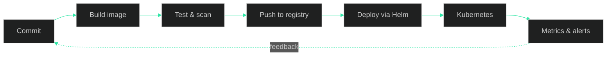

<!-- ═══════════════ HEADER ═══════════════ -->
<div align="center">


<a href="https://git.io/typing-svg">
  
</a>

<br/>


</div>

<br/>

<!-- ═══════════════ WHOAMI ═══════════════ -->
## `~/whoami`

```console
shubham@prod:~$ cat about.yaml
```

```yaml
name:        Shubham Shrestha
role:        DevOps Engineer
lives_in:    terminals, dashboards, and pipeline logs
currently:
  - shipping containerized workloads onto Kubernetes
  - hardening CI/CD pipelines until they stop paging people
  - going deeper on cluster networking and system design
ask_me_about: [Linux, Docker, Kubernetes, CI/CD, NGINX]
open_to:      DevOps and open-source collaboration
habit:        breaking systems on purpose, to learn how they actually work
motto:        "Automate everything. Understand systems deeply. Own production."
```

<br/>

<!-- ═══════════════ PIPELINE ═══════════════ -->
## How I Think About Delivery



<br/>

<!-- ═══════════════ STACK ═══════════════ -->
## Toolbox

<div align="center">

**Containers & Orchestration**


**CI/CD & Automation**


**Web Servers & Networking**


**Monitoring & Observability**


</div>

<br/>

<!-- ═══════════════ STATS ═══════════════ -->
## Signal, Not Noise

<div align="center">


</div>

<!--
═══════════════ FEATURED WORK (optional) ═══════════════
Uncomment and swap in your best repos. Two or three strong pins beat a wall of stats.

<div align="center">
  <a href="https://github.com/ShubhamShrestha60/REPO_ONE">
    
  </a>
  <a href="https://github.com/ShubhamShrestha60/REPO_TWO">
    
  </a>
</div>
-->

<br/>

<!-- ═══════════════ CONNECT ═══════════════ -->
## Let's Talk Infrastructure

<div align="center">

[](https://github.com/ShubhamShrestha60)
[](https://www.linkedin.com/in/shubham-shrestha-32870325a)
[](mailto:shrestha.subham.60@gmail.com)

<br/>


[](https://github.com/ShubhamShrestha60)


</div>
