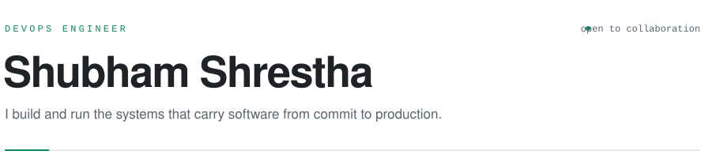

<picture>
  <source media="(prefers-color-scheme: dark)" srcset="assets/header-dark.svg">
  <source media="(prefers-color-scheme: light)" srcset="assets/header-light.svg">
  
</picture>

 

I work on containerized workloads, delivery pipelines, and the Linux fundamentals underneath them. I learn by taking systems apart: break it in staging, understand it in production.

**Now**

- Shipping containerized workloads onto Kubernetes
- Going deeper on cluster networking and system design
- Hardening CI/CD pipelines until they stop paging people

 

### Delivery

<picture>
  <source media="(prefers-color-scheme: dark)" srcset="assets/pipeline-dark.svg">
  <source media="(prefers-color-scheme: light)" srcset="assets/pipeline-light.svg">
  
</picture>

 

### Toolkit

<picture>
  <source media="(prefers-color-scheme: dark)" srcset="assets/toolkit-dark.svg">
  <source media="(prefers-color-scheme: light)" srcset="assets/toolkit-light.svg">
  
</picture>

 

### Contact

[GitHub](https://github.com/ShubhamShrestha60) &nbsp;·&nbsp; [LinkedIn](https://www.linkedin.com/in/shubham-shrestha-32870325a) &nbsp;·&nbsp; [Email](mailto:shrestha.subham.60@gmail.com)

<!--
Selected work: add two or three pinned repos on your GitHub profile itself
(Customize your pins), rather than embedding stat cards here.
-->
