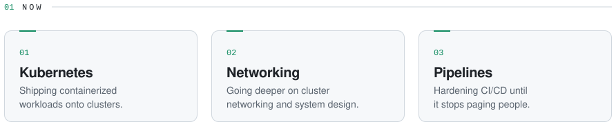
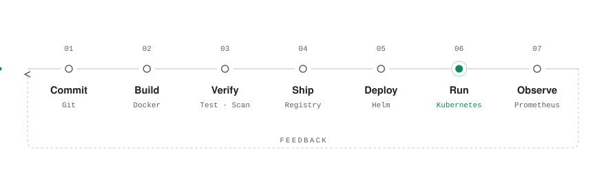
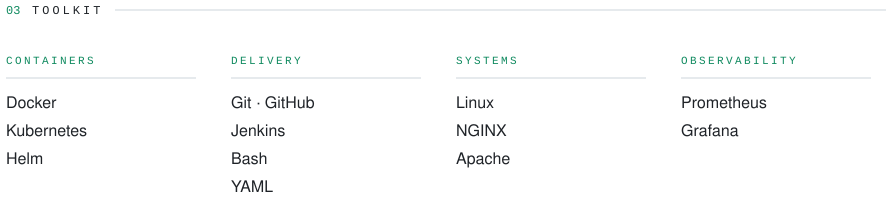
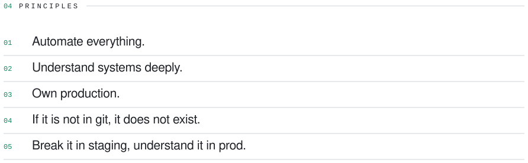

<picture>
  <source media="(prefers-color-scheme: dark)" srcset="assets/hero-dark.svg">
  <source media="(prefers-color-scheme: light)" srcset="assets/hero-light.svg">
  
</picture>

I work on containerized workloads, delivery pipelines, and the Linux fundamentals underneath them. I learn by taking systems apart on purpose. More at [shubham-shrestha.com.np](https://www.shubham-shrestha.com.np).

<picture>
  <source media="(prefers-color-scheme: dark)" srcset="assets/now-dark.svg">
  <source media="(prefers-color-scheme: light)" srcset="assets/now-light.svg">
  
</picture>

<picture>
  <source media="(prefers-color-scheme: dark)" srcset="assets/pipeline-dark.svg">
  <source media="(prefers-color-scheme: light)" srcset="assets/pipeline-light.svg">
  
</picture>

<picture>
  <source media="(prefers-color-scheme: dark)" srcset="assets/toolkit-dark.svg">
  <source media="(prefers-color-scheme: light)" srcset="assets/toolkit-light.svg">
  
</picture>

<picture>
  <source media="(prefers-color-scheme: dark)" srcset="assets/principles-dark.svg">
  <source media="(prefers-color-scheme: light)" srcset="assets/principles-light.svg">
  
</picture>

 

<a href="https://www.shubham-shrestha.com.np"><picture>
  <source media="(prefers-color-scheme: dark)" srcset="assets/btn-website-dark.svg">
  <source media="(prefers-color-scheme: light)" srcset="assets/btn-website-light.svg">
  
</picture></a>&nbsp;&nbsp;<a href="https://github.com/ShubhamShrestha60"><picture>
  <source media="(prefers-color-scheme: dark)" srcset="assets/btn-github-dark.svg">
  <source media="(prefers-color-scheme: light)" srcset="assets/btn-github-light.svg">
  
</picture></a>&nbsp;&nbsp;<a href="https://www.linkedin.com/in/shubham-shrestha-32870325a"><picture>
  <source media="(prefers-color-scheme: dark)" srcset="assets/btn-linkedin-dark.svg">
  <source media="(prefers-color-scheme: light)" srcset="assets/btn-linkedin-light.svg">
  
</picture></a>&nbsp;&nbsp;<a href="mailto:shrestha.subham.60@gmail.com"><picture>
  <source media="(prefers-color-scheme: dark)" srcset="assets/btn-email-dark.svg">
  <source media="(prefers-color-scheme: light)" srcset="assets/btn-email-light.svg">
  
</picture></a>
