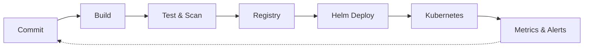

 

# Shubham Shrestha

**DevOps Engineer**

Kubernetes &nbsp;·&nbsp; CI/CD &nbsp;·&nbsp; Linux &nbsp;·&nbsp; Infrastructure Automation

 

 

---

### About

I build and run the systems that carry software from commit to production. My work centers on containerized workloads, reliable delivery pipelines, and the Linux fundamentals underneath them.

I learn by taking systems apart: breaking things in staging so I understand them in production.

&nbsp;

|  |  |
| :-- | :-- |
| **Currently** | Shipping containerized workloads to Kubernetes |
| **Deepening** | Cluster networking and system design |
| **Improving** | CI/CD pipelines: faster, quieter, more predictable |
| **Open to** | DevOps and open-source collaboration |

&nbsp;

> *Automate everything. Understand systems deeply. Own production.*

---

### Delivery Flow

```mermaid
flowchart LR
    A[Commit] --> B[Build]
    B --> C[Test & Scan]
    C --> D[Registry]
    D --> E[Helm Deploy]
    E --> F[Kubernetes]
    F --> G[Metrics & Alerts]
    G -.-> A
```

---

### Toolkit

| | |
| :-- | :-- |
| **Containers & Orchestration** |    |
| **CI/CD & Automation** |     |
| **Systems & Networking** |    |
| **Observability** |   |

---

### Activity

<a href="https://github.com/ShubhamShrestha60">
  <picture>
    <source media="(prefers-color-scheme: dark)" srcset="https://github-readme-stats.vercel.app/api?username=ShubhamShrestha60&show_icons=true&theme=transparent&hide_border=true&title_color=E6EDF3&text_color=8B949E&icon_color=8B949E&hide_title=true&hide=contribs&hide_rank=false&card_width=400" />
    <source media="(prefers-color-scheme: light)" srcset="https://github-readme-stats.vercel.app/api?username=ShubhamShrestha60&show_icons=true&theme=transparent&hide_border=true&title_color=1F2328&text_color=59636E&icon_color=59636E&hide_title=true&hide=contribs&hide_rank=false&card_width=400" />
    
  </picture>
  &nbsp;&nbsp;
  <picture>
    <source media="(prefers-color-scheme: dark)" srcset="https://github-readme-stats.vercel.app/api/top-langs/?username=ShubhamShrestha60&layout=compact&theme=transparent&hide_border=true&hide_title=true&text_color=8B949E&card_width=300" />
    <source media="(prefers-color-scheme: light)" srcset="https://github-readme-stats.vercel.app/api/top-langs/?username=ShubhamShrestha60&layout=compact&theme=transparent&hide_border=true&hide_title=true&text_color=59636E&card_width=300" />
    
  </picture>
</a>

<!--
Selected Work (optional)
Two or three strong pins say more than a wall of stats. Uncomment and replace the repo names.

### Selected Work

  
  

-->

---

Open to conversations about infrastructure, reliability, and open source.

 

[GitHub](https://github.com/ShubhamShrestha60) &nbsp;·&nbsp; [LinkedIn](https://www.linkedin.com/in/shubham-shrestha-32870325a) &nbsp;·&nbsp; [Email](mailto:shrestha.subham.60@gmail.com)

 

